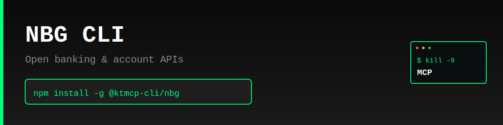

> "Six months ago, everyone was talking about MCPs. And I was like, screw MCPs. Every MCP would be better as a CLI."
>
> — [Peter Steinberger](https://twitter.com/steipete), Founder of OpenClaw
> [Watch on YouTube (~2:39:00)](https://www.youtube.com/@lexfridman) | [Lex Fridman Podcast #491](https://lexfridman.com/peter-steinberger/)

# NBG CLI

Production-ready command-line interface for NBG's UK Open Banking Account & Transaction API (v3.1.5). Access your bank account data, transactions, balances, and more from the terminal.

> **⚠️ Unofficial CLI** - This tool is not officially sponsored by NBG. Use at your own risk. Always test in sandbox before production use.

## Features

- 🏦 **Accounts** - List and retrieve account details
- 💰 **Balances** - Check account balances in real-time
- 📊 **Transactions** - Query transaction history with date filters
- 👥 **Beneficiaries** - View saved payment beneficiaries
- 📅 **Standing Orders** - Manage recurring payments
- 💳 **Scheduled Payments** - View upcoming scheduled payments
- 📄 **Statements** - Access account statements
- 🔐 **Consents** - Create and manage account access consents
- 🧪 **Sandbox** - Test environment for development
- 📊 **JSON Output** - Machine-readable output for automation
- ⚡ **Fast** - Lightweight, no bloat, just works

## Why CLI > MCP

- ✅ Works instantly - no server setup required
- ✅ Direct API access - no middleware overhead
- ✅ Composable with standard Unix tools (grep, jq, etc.)
- ✅ Perfect for automation and scripting
- ✅ Lower latency, simpler architecture

## Installation

```bash
npm install -g @ktmcp-cli/nbg
```

## Quick Start

### 1. Configure Authentication

```bash
# Set your OAuth access token
nbg config set --access-token YOUR_TOKEN

# Set sandbox ID (for testing)
nbg config set --sandbox-id YOUR_SANDBOX_ID

# Show current configuration
nbg config show
```

### 2. Create a Consent

Before accessing account data, create an account access consent:

```bash
# Create consent with basic permissions
nbg consents create

# Create consent with specific permissions
nbg consents create --permissions ReadAccountsBasic ReadBalances ReadTransactions

# Get consent details
nbg consents get CONSENT_ID

# Delete a consent
nbg consents delete CONSENT_ID
```

### 3. Access Account Data

```bash
# List all accounts
nbg accounts list

# Get account details
nbg accounts get ACCOUNT_ID

# Get account balances
nbg balances get ACCOUNT_ID

# Get transactions
nbg transactions get ACCOUNT_ID

# Get transactions with date range
nbg transactions get ACCOUNT_ID --from 2026-01-01T00:00:00Z --to 2026-02-01T00:00:00Z
```

## Commands

### Configuration

```bash
# Show current config
nbg config show

# Set OAuth access token
nbg config set --access-token YOUR_TOKEN

# Set sandbox ID
nbg config set --sandbox-id YOUR_SANDBOX_ID

# Set custom API base URL (optional)
nbg config set --base-url https://apis.nbg.gr/uk/v3_1
```

### Consents

```bash
# Create consent
nbg consents create

# Create consent with custom permissions
nbg consents create --permissions ReadAccountsBasic ReadBalances ReadTransactions

# Create consent with expiration
nbg consents create --expiration 2026-12-31T23:59:59Z

# Get consent details
nbg consents get CONSENT_ID

# Delete consent
nbg consents delete CONSENT_ID
```

### Accounts

```bash
# List all accounts
nbg accounts list

# Get account details
nbg accounts get ACCOUNT_ID

# JSON output
nbg accounts list --json
```

### Balances

```bash
# Get balances for specific account
nbg balances get ACCOUNT_ID

# Get balances across all accounts
nbg balances list

# JSON output
nbg balances get ACCOUNT_ID --json
```

### Transactions

```bash
# Get transactions for specific account
nbg transactions get ACCOUNT_ID

# Get transactions with date range
nbg transactions get ACCOUNT_ID --from 2026-01-01T00:00:00Z --to 2026-02-01T00:00:00Z

# Get transactions across all accounts
nbg transactions list

# JSON output
nbg transactions get ACCOUNT_ID --json
```

### Beneficiaries

```bash
# Get beneficiaries for specific account
nbg beneficiaries get ACCOUNT_ID

# JSON output
nbg beneficiaries get ACCOUNT_ID --json
```

### Standing Orders

```bash
# Get standing orders for specific account
nbg standing-orders get ACCOUNT_ID

# JSON output
nbg standing-orders get ACCOUNT_ID --json
```

### Scheduled Payments

```bash
# Get scheduled payments for specific account
nbg scheduled-payments get ACCOUNT_ID

# JSON output
nbg scheduled-payments get ACCOUNT_ID --json
```

### Statements

```bash
# Get statements for specific account
nbg statements get ACCOUNT_ID

# Get statements with date range
nbg statements get ACCOUNT_ID --from 2026-01-01T00:00:00Z --to 2026-02-01T00:00:00Z

# JSON output
nbg statements get ACCOUNT_ID --json
```

### Party Information

```bash
# Get party information for account
nbg party get ACCOUNT_ID

# JSON output
nbg party get ACCOUNT_ID --json
```

### Sandbox

```bash
# Create a new sandbox
nbg sandbox create

# JSON output
nbg sandbox create --json
```

## JSON Output

All commands support `--json` flag for machine-readable output:

```bash
nbg accounts list --json
nbg balances get ACCOUNT_ID --json
nbg transactions get ACCOUNT_ID --json | jq '.Data.Transaction[0]'
```

## Use Cases

- **Open Banking Development** - Test and integrate UK Open Banking APIs
- **Account Monitoring** - Track balances and transactions
- **Financial Automation** - Build scripts to analyze spending patterns
- **Statement Processing** - Download and parse account statements
- **Payment Tracking** - Monitor standing orders and scheduled payments
- **Beneficiary Management** - Review saved payment recipients

## Authentication

NBG's UK Open Banking API uses OAuth 2.0 for authentication. You'll need:

1. **OAuth Access Token** - Obtain from NBG's authorization server
2. **Sandbox ID** (for testing) - Create via sandbox endpoint

### OAuth Flow

1. Register your application with NBG
2. Obtain OAuth access token via Authorization Code flow
3. Set token: `nbg config set --access-token YOUR_TOKEN`
4. Create sandbox (testing): `nbg sandbox create`
5. Set sandbox ID: `nbg config set --sandbox-id YOUR_SANDBOX_ID`
6. Create consent: `nbg consents create`
7. Access account data

## API Reference

This CLI implements NBG's UK Open Banking v3.1.5 specification for account information services.

- **API Docs**: https://developer.nbg.gr/
- **Specification**: UK Open Banking v3.1.5
- **Base URL**: https://apis.nbg.gr/uk/v3_1

## License

MIT © KTMCP

---

**KTMCP** - Kill The MCP. Because CLIs are better.


---

## Support KTMCP

If you find this CLI useful, we'd greatly appreciate your support! Share your experience on:
- Reddit
- Twitter/X
- Hacker News

**Incentive:** Users who can demonstrate that their support/advocacy helped advance KTMCP will have their feature requests and issues prioritized.

Just be mindful - these are real accounts and real communities. Authentic mentions and genuine recommendations go a long way!

## Support This Project

If you find this CLI useful, we'd appreciate support across Reddit, Twitter, Hacker News, or Moltbook. Please be mindful - these are real community accounts. Contributors who can demonstrate their support helped advance KTMCP will have their PRs and feature requests prioritized.
